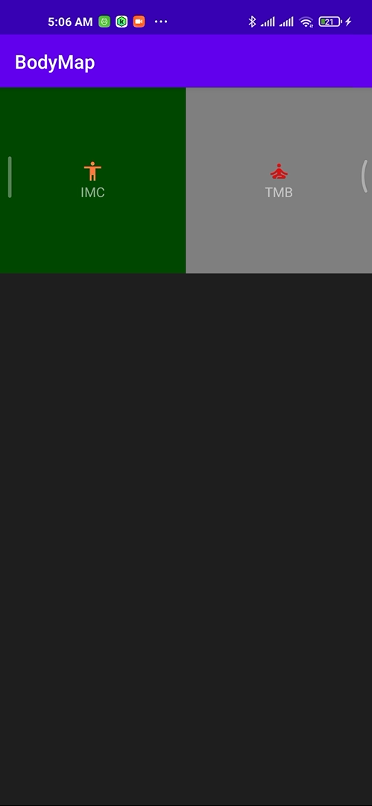
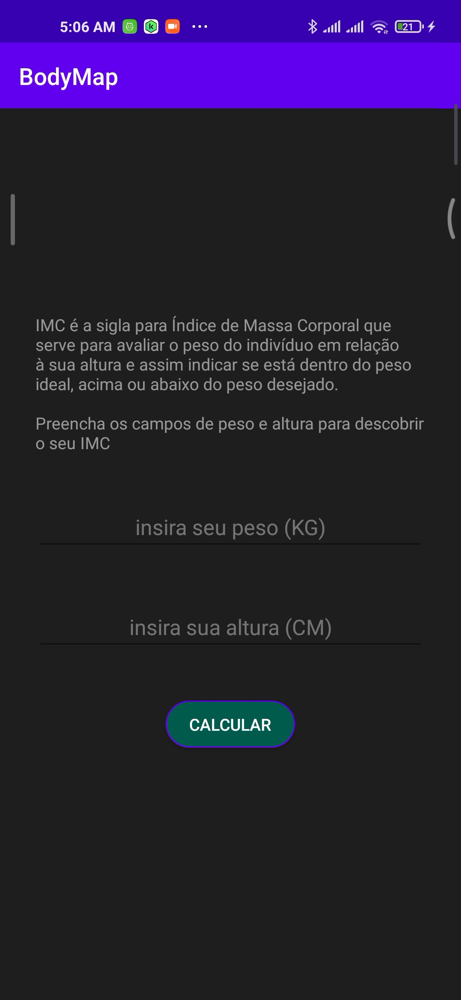
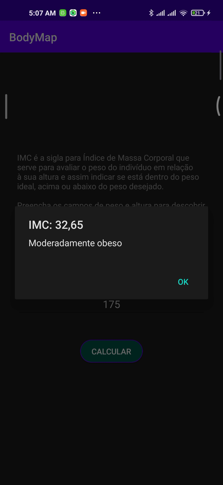
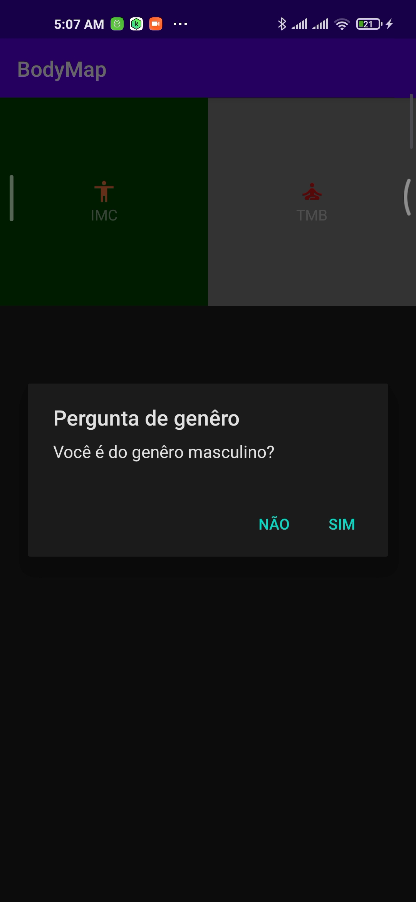
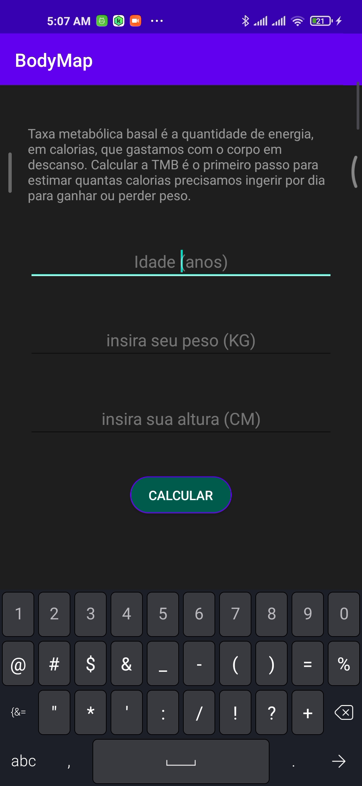

# BodyMap

  
  
  
   
   
  
  <h1>aplicativo para calculos de IMC, TMB e mais em breve</h1>
  <h2>foi feito com o intuito de treinar recyclerview, chamada de intenções e alertas de dialogos</h2>
  

